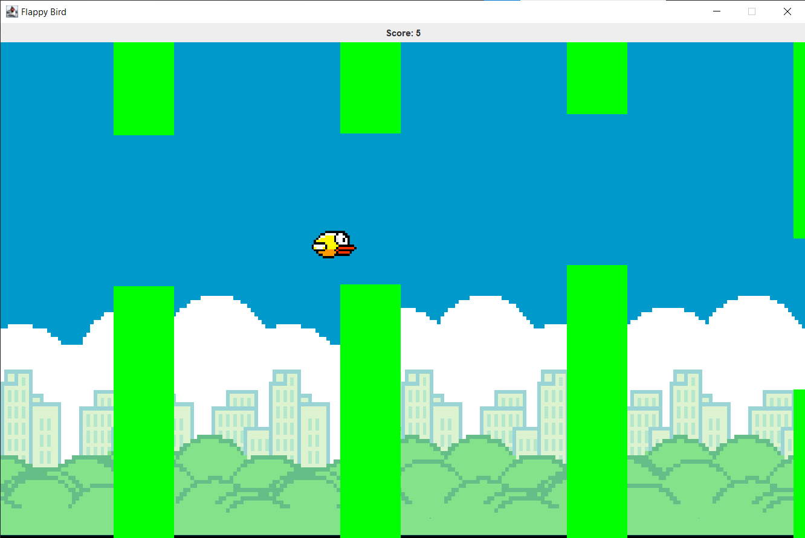

# Java Flappy Bird Clone

## Introduction

This project is a clone of the popular game Flappy Bird, developed in Java using the Swing library for graphical user interface components. The game replicates the core mechanics of Flappy Bird, where the player controls a bird, attempting to fly between columns of green pipes without hitting them.

## Features

- **Simple Controls**: The game is controlled by a single key press, making it easy to play but hard to master.
- **Score Tracking**: Scores are calculated based on the number of pipes the bird successfully navigates past.
- **Dynamic Obstacles**: The gaps between pipes vary in size and position, requiring patience and timing to achieve high scores.
- **Graphical UI**: Utilizes Java Swing for rendering the game's graphics, providing a smooth and visually appealing experience.

## How to Play

- **Start the Game**: Run the `FlappyBird.java` file to start the game.
- **Gameplay**: Press spacebar to make the bird flap its wings and fly upwards. Release the key to let the bird fall due to gravity.
- **Objective**: Avoid hitting the pipes and the ground to achieve the highest score possible.

## Screenshot

